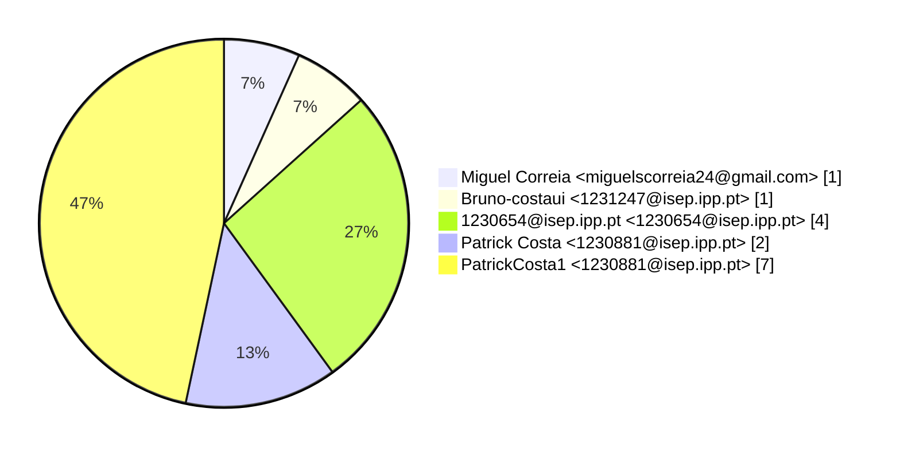
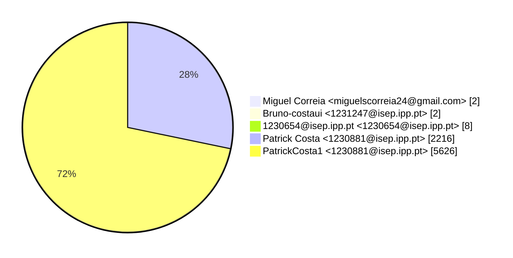
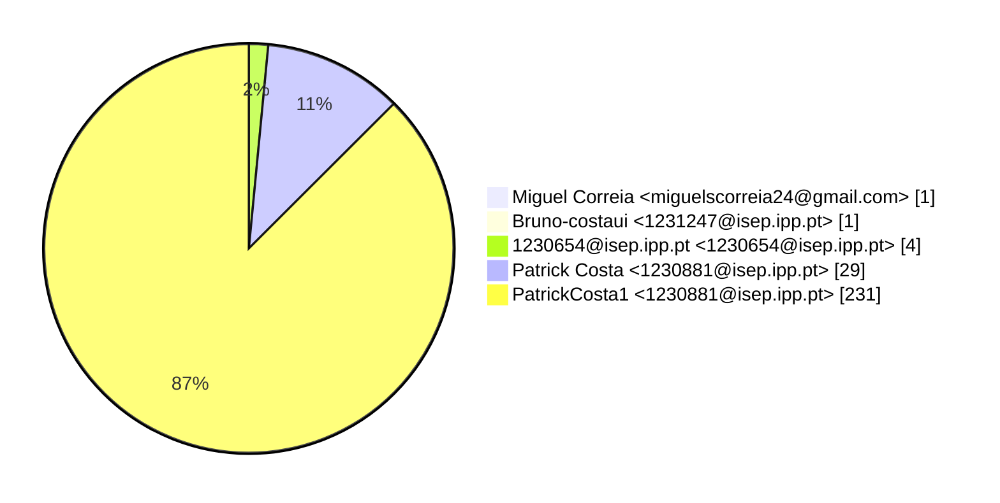

# Contribution stats by author 
|author|insertions|insertions_per|deletions|deletions_per|files|files_per|commits|commits_per|lines_changed|lines_changed_per|
|---|---|---|---|---|---|---|---|---|---|---|
| Miguel Correia <miguelscorreia24@gmail.com>|1|0%|1|0%|1|0%|1|7%|2|0%|
| Bruno-costaui <1231247@isep.ipp.pt>|2|0%|0|0%|1|0%|1|7%|2|0%|
| 1230654@isep.ipp.pt <1230654@isep.ipp.pt>|4|0%|4|0%|4|2%|4|27%|8|0%|
| Patrick Costa <1230881@isep.ipp.pt>|2012|29%|204|24%|29|11%|2|13%|2216|28%|
| PatrickCosta1 <1230881@isep.ipp.pt>|4975|71%|651|76%|231|87%|7|47%|5626|72%|

## Commits percentage

## Lines changed

## Files changed

