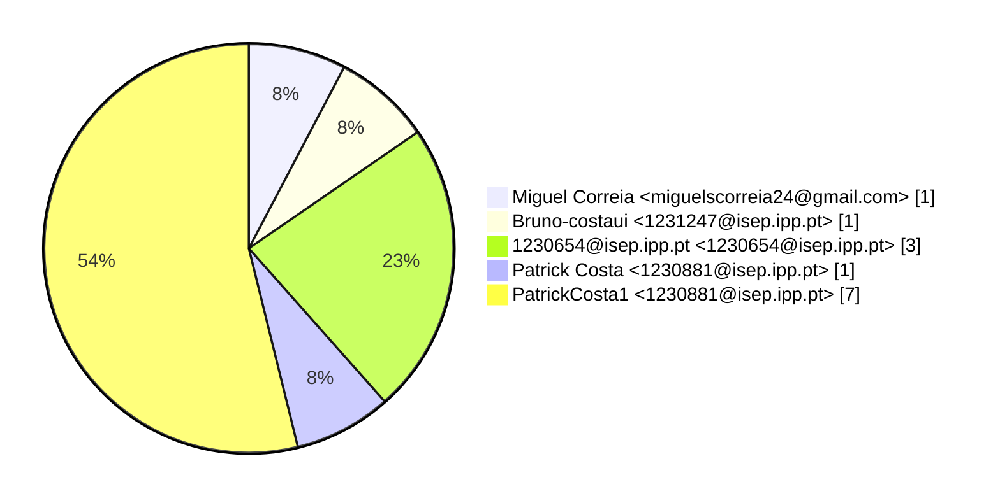
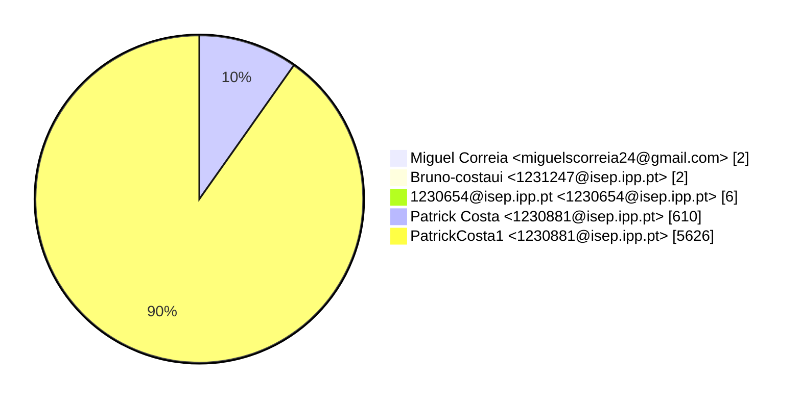
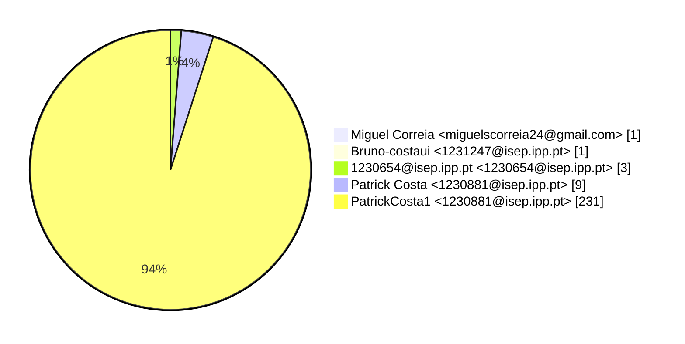

# Contribution stats by author 
|author|insertions|insertions_per|deletions|deletions_per|files|files_per|commits|commits_per|lines_changed|lines_changed_per|
|---|---|---|---|---|---|---|---|---|---|---|
| Miguel Correia <miguelscorreia24@gmail.com>|1|0%|1|0%|1|0%|1|8%|2|0%|
| Bruno-costaui <1231247@isep.ipp.pt>|2|0%|0|0%|1|0%|1|8%|2|0%|
| 1230654@isep.ipp.pt <1230654@isep.ipp.pt>|3|0%|3|0%|3|1%|3|23%|6|0%|
| Patrick Costa <1230881@isep.ipp.pt>|539|10%|71|10%|9|4%|1|8%|610|10%|
| PatrickCosta1 <1230881@isep.ipp.pt>|4975|90%|651|90%|231|94%|7|54%|5626|90%|

## Commits percentage

## Lines changed

## Files changed

