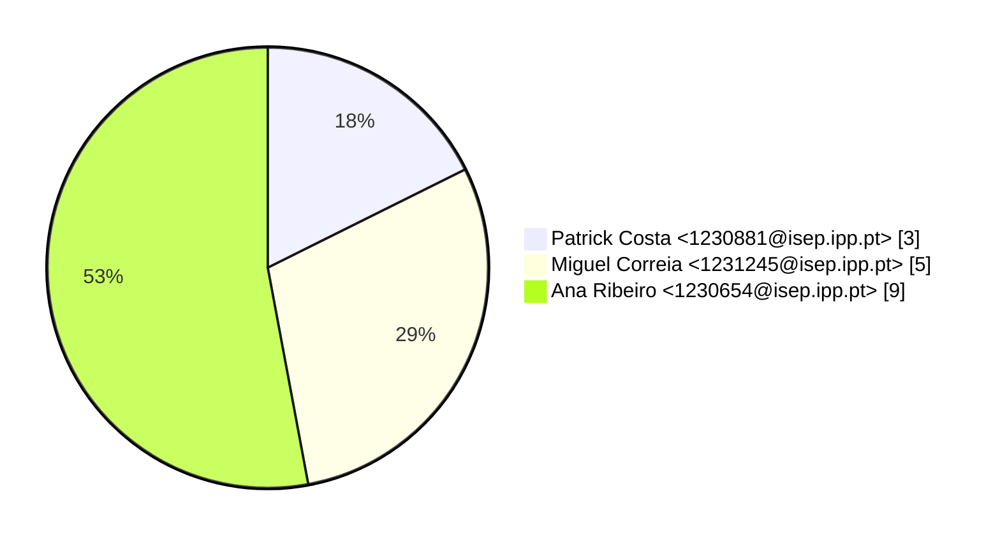
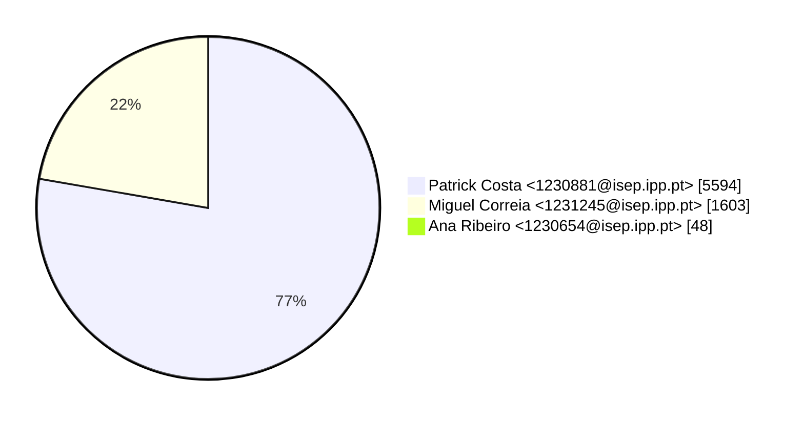
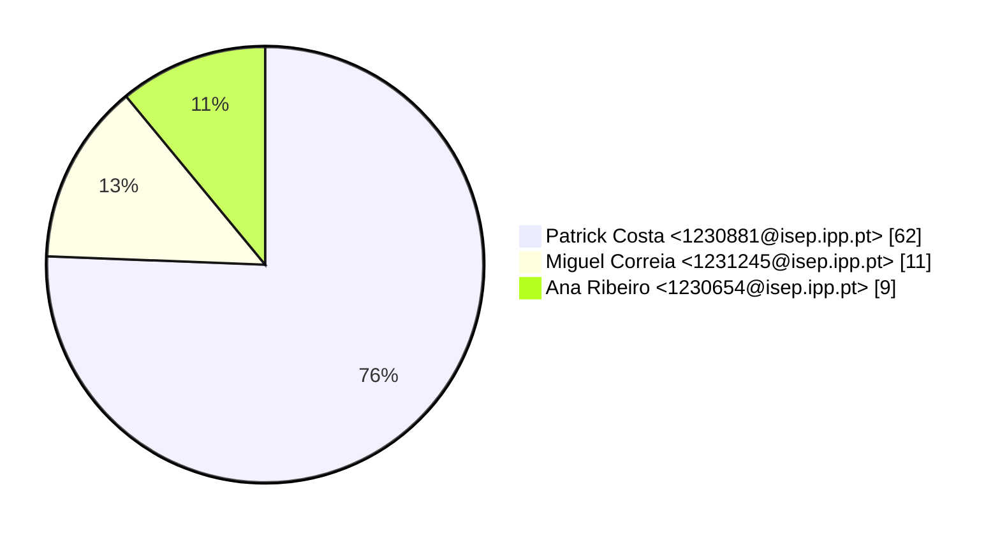

# Contribution stats by author 
|author|insertions|insertions_per|deletions|deletions_per|files|files_per|commits|commits_per|lines_changed|lines_changed_per|
|---|---|---|---|---|---|---|---|---|---|---|
| Patrick Costa <1230881@isep.ipp.pt>|3079|72%|2515|85%|62|76%|3|18%|5594|77%|
| Miguel Correia <1231245@isep.ipp.pt>|1177|27%|426|14%|11|13%|5|29%|1603|22%|
| Ana Ribeiro <1230654@isep.ipp.pt>|25|1%|23|1%|9|11%|9|53%|48|1%|

## Commits percentage

## Lines changed

## Files changed

