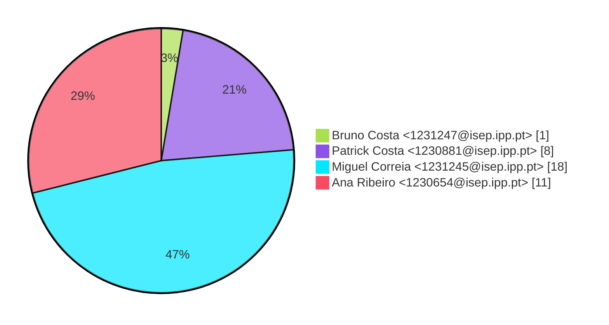
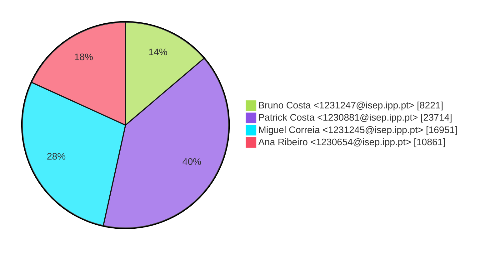
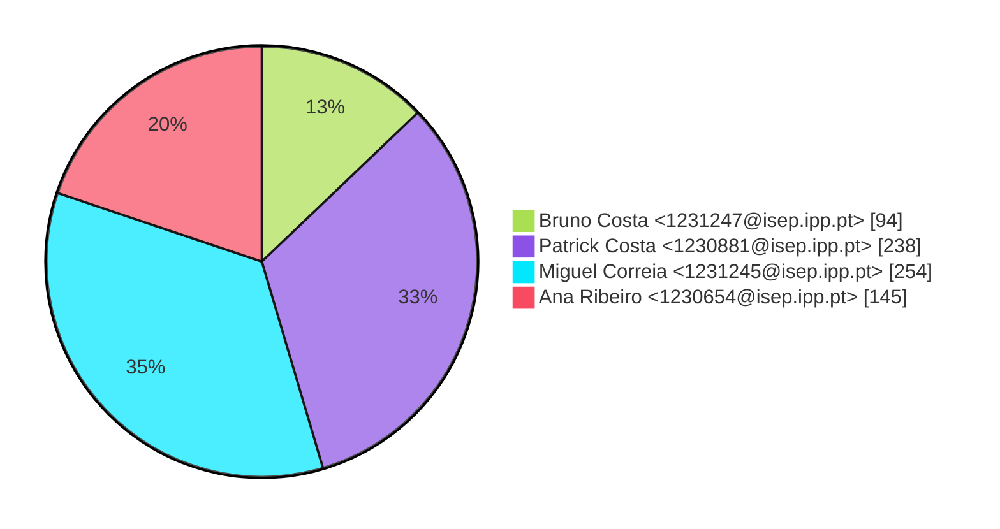

# Contribution stats by author 
|author|insertions|insertions_per|deletions|deletions_per|files|files_per|commits|commits_per|lines_changed|lines_changed_per|
|---|---|---|---|---|---|---|---|---|---|---|
| Bruno Costa <1231247@isep.ipp.pt>|6850|16%|1371|8%|94|13%|1|3%|8221|14%|
| Patrick Costa <1230881@isep.ipp.pt>|14192|33%|9522|55%|238|33%|8|21%|23714|40%|
| Miguel Correia <1231245@isep.ipp.pt>|12639|30%|4312|25%|254|35%|18|47%|16951|28%|
| Ana Ribeiro <1230654@isep.ipp.pt>|8693|21%|2168|12%|145|20%|11|29%|10861|18%|

## Commits percentage

## Lines changed

## Files changed

