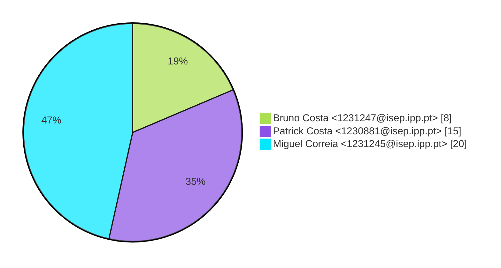
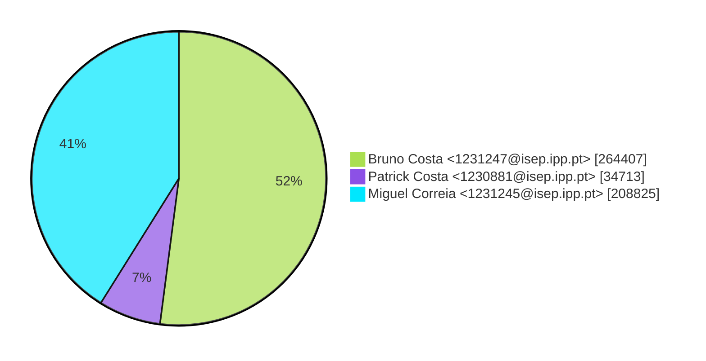
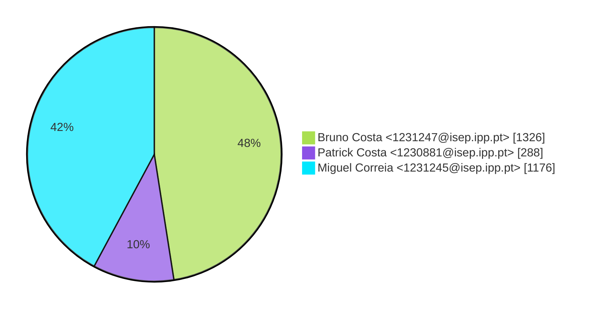

# Contribution stats by author 
|author|insertions|insertions_per|deletions|deletions_per|files|files_per|commits|commits_per|lines_changed|lines_changed_per|
|---|---|---|---|---|---|---|---|---|---|---|
| Bruno Costa <1231247@isep.ipp.pt>|259260|53%|5147|25%|1326|48%|8|19%|264407|52%|
| Patrick Costa <1230881@isep.ipp.pt>|28957|6%|5756|28%|288|10%|15|35%|34713|7%|
| Miguel Correia <1231245@isep.ipp.pt>|199022|41%|9803|47%|1176|42%|20|47%|208825|41%|

## Commits percentage

## Lines changed

## Files changed

